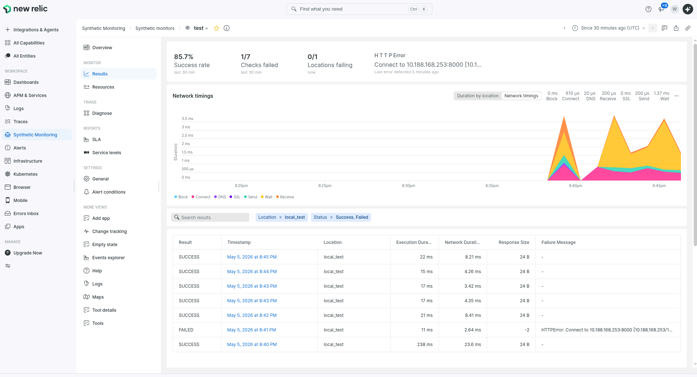

# Lab — Internal API Monitoring with New Relic Private Location
 
New Relic is an observability platform (APM, logs, metrics, synthetics) that lets you monitor the health of your applications and infrastructure in real time.
 
One of its key features is **Synthetic Monitoring**: New Relic periodically sends requests to your endpoints to measure their availability and latency — essentially a robot that continuously checks whether your API is responding correctly.
 
### The problem: API behind a firewall or VPN
 
By default, New Relic probes are hosted in the public cloud. They cannot reach an API running inside a private network (corporate network, behind a VPN, or protected by a firewall).
 
This is where **Private Location** comes in: you deploy an agent (*Synthetics Job Manager*) **inside** your local network. This agent receives instructions from New Relic via an outbound connection (no inbound port needs to be opened), runs the checks from within your network, and sends the results back. You get all New Relic alerting (downtime, latency, errors) on services that are never exposed to the internet.
 
---

 
## 1. Start the FastAPI server
 
```bash
pip install fastapi uvicorn
uvicorn main:app --host 0.0.0.0 --port 8000
```
 
> `--host 0.0.0.0` exposes the API on all network interfaces — required so the Job Manager container can reach it.
 
### Available routes
 
| Method | Route | Response |
|--------|-------|----------|
| `GET` | `/` | `{"message": "Hello World"}` |
| `GET` | `/health` | `{"status": "ok"}` |
| `GET` | `/items` | list of items |
| `GET` | `/items/{id}` | item by id |
 
---
 
## 2. Create a New Relic account
 
The **Free Tier** is enough for this lab: [https://newrelic.com/signup](https://newrelic.com/signup)
 
---
 
## 3. Create the Private Location
 
In the New Relic UI:
 
```
one.newrelic.com → Synthetic Monitoring → Private Locations → Create
```
 
Give your location a name and **copy the generated private key** (`PRIVATE_LOCATION_KEY`) — you will need it in the next step.
 
---
 
## 4. Deploy the Synthetics Job Manager (Docker)
 
```bash
docker run \
  --name newrelic-job-manager \
  -e PRIVATE_LOCATION_KEY=<your_key> \
  -e HORDE_API_ENDPOINT=https://synthetics-horde.eu01.nr-data.net \
  -e VSE_PASSPHRASE=<your_passphrase> \
  -d \
  --restart unless-stopped \
  -v /var/run/docker.sock:/var/run/docker.sock:rw \
  newrelic/synthetics-job-manager
```
 
> **`VSE_PASSPHRASE`** is a passphrase you choose freely. It will be required when creating *Scripted API* monitors to encrypt the scripts.
 
### View Job Manager logs
 
```bash
docker logs --follow newrelic-job-manager
```
 
---
 
## 5. Create a Synthetic Monitor — Ping type (free)
 
```
one.newrelic.com → All Capabilities → Synthetic Monitoring → Create monitor
```
 
| Parameter | Value |
|-----------|-------|
| Type | **Ping** |
| Target URL | `http://<YOUR_IP>:8000/health` |
| Location | your Private Location |
| Period | 1 minute |
 
> Use your machine's local IP address (e.g. `192.168.x.x`), not `localhost` — the Job Manager runs in a separate Docker container.
 
---
 
## 6. Create a Synthetic Monitor — Scripted API type (paid)
 
```
one.newrelic.com → All Capabilities → Synthetic Monitoring → Create monitor
```
 
| Parameter | Value |
|-----------|-------|
| Type | **Scripted API** |
| Target URL | `http://<YOUR_IP>:8000/` |
| Location | your Private Location |
| Period | 1 minute |
| Runtime | Node.js (latest version recommended) |
 
Paste a test script, enter your `VSE_PASSPHRASE`, then save.
 
---
 
## 7. Verification & downtime simulation
 
To simulate a downtime, simply **stop the FastAPI server** (`Ctrl+C`).
 
New Relic will detect the unavailability within the next minute and trigger an alert.
 
Check the results at:
 
```
Synthetic Monitoring → Monitors → <your monitor> → Uptime / Latency / Alerts
```
 
---
 
## Example result in the UI
 


 additionals links : 

 [official docs of New Relic](https://github.com/newrelic/docs-website/blob/develop/src/content/docs/synthetics/synthetic-monitoring/private-locations/install-job-manager.mdx)

 
 

 [Good blog post about New relics and its benefits](https://github.com/newrelic/docs-website/blob/develop/src/content/docs/synthetics/synthetic-monitoring/private-locations/install-job-manager.mdx)

 
